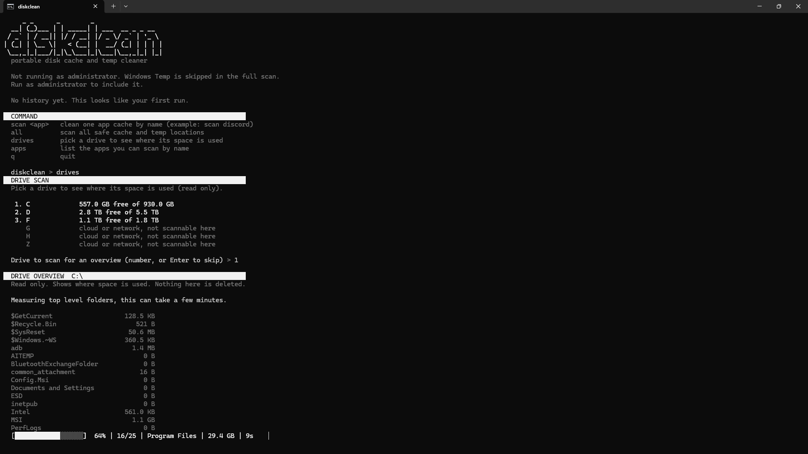

# diskclean

A portable, cross platform disk cache and temp cleaner for the terminal. It scans the known safe cache and temp locations on your computer, shows their sizes, lets you pick what to remove, and cleans with a live progress bar that shows elapsed time and ETA.

Works on Windows, macOS, and Linux. No dependencies. No installer. Just run it.

## Why I made this

I made this as a personal tool to speedrun cleaning my disk. One day I was too lazy to open the built-in Disk Cleanup, so I built my own thing to quickly scan and tell me what is safe to delete. I was in the mood for some terminal aesthetics, so I built it around that.

Cache and temp folders quietly grow over time (browser caches, app caches, package caches, crash dumps, trash). diskclean finds the safe ones, tells you how much space each is using, and clears only what you choose.

## Features

- Pure Python, zero dependencies, runs anywhere Python runs
- A command prompt: type `scan discord` (or any app) and it finds that app's cache for your OS and offers to clean it. Great for a quick one app speedrun.
- Monochrome white terminal theme with an ASCII banner
- Live progress bar with elapsed time and ETA while scanning and cleaning
- Pick exactly what to clean from a numbered menu (single items, ranges, or all)
- Clear confirmation before anything is deleted
- Per item result after cleaning: done, partial, or skipped
- A timestamped history log so you can see your last runs and how space changed
- Pick a drive to see a read-only overview of where its space is used. Cloud and network mounts (Google Drive, rclone, network shares) are detected and skipped so it does not crawl them
- Cross platform: it knows the right cache locations for Windows, macOS, and Linux

## Commands

diskclean opens to a command prompt. These are the commands it accepts:

| Command | What it does |
| --- | --- |
| `scan <app>` | Clean one app cache by name, for example `scan discord`. It finds that app's cache for your operating system, shows the size, and asks before it cleans. |
| `all` | Scan every safe cache and temp location, then pick what to clean from a numbered menu. |
| `drives` | Pick a drive to see a read only overview of where its space is used. Nothing here is deleted. |
| `apps` | List the apps you can scan by name. |
| `q` | Quit. |

In the `all` menu you choose what to clean by number. You can type a single number, a list like `1,3,5`, a range like `2-6`, or `all`.

`scan <app>` matches the app name to a known cache location for your operating system, so `scan discord` looks in the right place on Windows, macOS, and Linux. It only ever touches that app's cache folders, never its settings or login. If the app is not installed, or it is a sandboxed build such as a Linux Flatpak or Snap, it reports nothing to clean instead of touching anything else.

Apps you can scan by name include Discord, Chrome, Edge, Brave, Opera, Spotify, Slack, Teams, VS Code, Steam, NVIDIA, pip, and npm. The exact list adapts to your operating system, and you can always type `apps` to see it.

## Safety

diskclean only ever touches a built in list of cache and temp folders that regenerate on their own. It never deletes system files, installed programs, or personal data. Nothing is removed without your confirmation.

One important note: deletion is permanent. Cleared files do not go to a recycle bin or trash. This is intentional, because the goal is to free space immediately, and everything on the list is disposable cache that the apps rebuild as you use them.

## Requirements

Python 3.7 or newer. That is it. Most systems already have Python. On Windows you can get it from python.org or the Microsoft Store.

## How to run

Windows: double click `diskclean.bat`, or run `python diskclean.py` in a terminal. To also clear the Windows Temp folder, run the bat as administrator (right click, Run as administrator).

macOS and Linux: run `./diskclean.sh`, or `python3 diskclean.py`. Make the script executable first with `chmod +x diskclean.sh`.

## What it cleans

Windows: user temp, Windows temp, crash dumps, pip cache, NVIDIA shader cache, Chrome cache, Edge cache, Spotify cache, Discord cache.

macOS: user Library caches, user logs, Trash, Chrome cache, pip cache.

Linux: the user cache in ~/.cache, thumbnail cache, Trash, pip cache, Chrome and Chromium cache.

If an app or folder is not present on your machine, it simply shows as empty and is skipped.

## How it works

diskclean opens to a command prompt. The commands it accepts are listed in the Commands section above.

Before anything is deleted it shows the size and a clear warning, then waits for your confirmation. Cleaning shows a live progress bar and a per item result (done, partial, or skipped). Each cleanup is written to the history log.

## Terminal font

For the exact retro look in the screenshots, set your terminal font to a pixel font such as VT323. diskclean uses whatever font your terminal is set to, so this is optional.

## License

MIT. See the LICENSE file.
